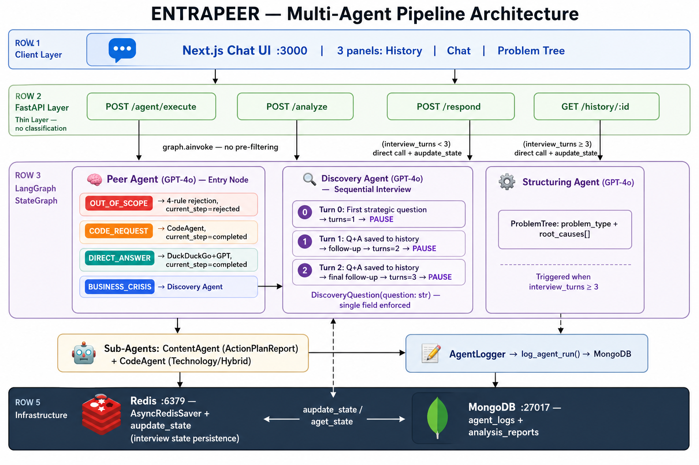
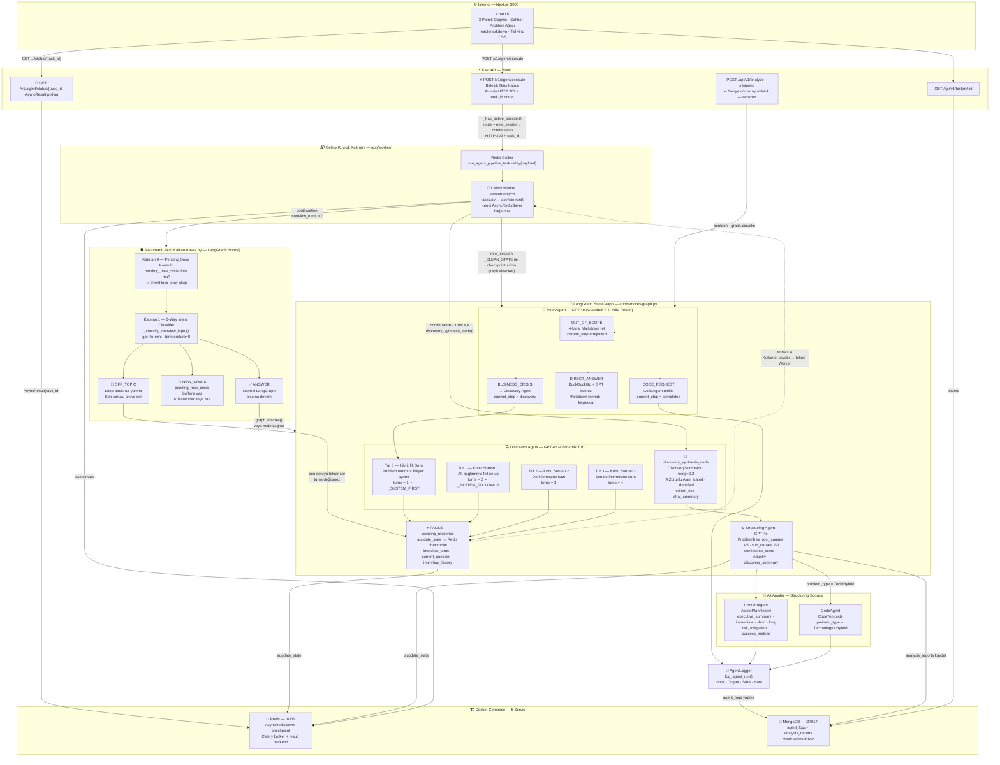

# ENTRAPEER — Multi-Agent Business Problem Analysis Platform

An AI-powered platform that transforms unstructured business crises into structured, actionable intelligence through a collaborative multi-agent pipeline built on **LangGraph**, **FastAPI**, and **Next.js**.

---

## Architecture Overview

Aşağıdaki diyagram; istemci katmanından başlayarak yeni **Celery kuyruk katmanı**, Peer Agent'ın 4-yollu yönlendirmesi, LangGraph ardışık mülakat pipeline'ı, Discovery sentez adımı, alt ajanlar, loglama akışı ve tüm altyapı servislerini tek bir görünümde göstermektedir.



> **Mimari özeti:** `POST /v1/agent/execute` (önek yok) tüm konuşma yaşam döngüsünün **tek giriş kapısıdır** — yeni kriz veya devam eden mülakat cevabı fark etmeksizin. Endpoint anında `task_id` döner; gerçek LangGraph pipeline işi **Celery Worker** sürecinde asenkron çalışır. Sonuç `GET /v1/agent/status/{task_id}` ile polling ile alınır. Eski `/api/v1/analyze` ve `/api/v1/respond` endpoint'leri geriye dönük uyumluluk için korunmaktadır.

<details>
<summary>📐 Mermaid kaynak diyagramını göster (GitHub / VS Code önizleme)</summary>



> **Okuma Kılavuzu**
> - **`POST /v1/agent/execute` ⭐** → Tüm yaşam döngüsünün tek giriş kapısı. Routing kararı (`new_session` / `continuation`) `_has_active_session()` ile sunucu tarafında verilir; endpoint HTTP 202 + `task_id` dönerek anında serbest kalır.
> - **3-Katmanlı Kalkan** → LangGraph çalıştırılmadan önce Worker içinde devreye girer. `OFF_TOPIC` girdiler tur hakkı yakılmadan loop-back'e düşer. `NEW_CRISIS` tespiti `pending_new_crisis` buffer üzerinden teyit isteyerek state'i korur. Kalkan geçilmeden LangGraph hiç tetiklenmez.
> - **Discovery Agent — 4 Dinamik Tur** → Tur 0: yönelim/problem ayrımı. Tur 1-3: derinlemesine konu soruları. Her turda `interview_turns`, `current_question`, `interview_history` Redis checkpoint'ine yazılır; sonraki Worker çağrısı doğru turdan devam eder.
> - **`discovery_synthesis_node`** → `interview_turns = 4` olduğunda aktif; `DiscoverySummary` (4 zorunlu alan) üretir. Structuring'den önce çalışır.
> - **Structuring Agent** → `ProblemTree` + `discovery_summary` üretir; `root_causes` 3-5, `sub_causes` 2-3 Pydantic kısıtıyla enforce edilir.
> - **ContentAgent** → `ActionPlanReport` (executive + immediate + short/long + `risk_mitigation` + `success_metrics`) üretir.
> - **Redis** → Çift görev: LangGraph `AsyncRedisSaver` (session checkpoint) + Celery broker/result backend.
> - **Docker Compose** → 5 servis: `web` · `worker` · `redis` · `mongodb` · `frontend`.

</details>

---

## Tech Stack

| Layer | Technology |
|---|---|
| **Backend API** | FastAPI 0.138 + Uvicorn |
| **Agent Orchestration** | LangGraph 1.2 (StateGraph + MemorySaver / AsyncRedisSaver) |
| **LLM** | OpenAI GPT-4o (tüm ajan düğümleri) |
| **Session Memory** | Redis + `AsyncRedisSaver` + `aupdate_state` (turn-by-turn persistence) |
| **Persistence** | MongoDB + Motor (async driver) |
| **Search** | DuckDuckGo (`ddgs`) — Peer Agent DIRECT_ANSWER yolunda |
| **Task Queue** | Celery 5.4 + Redis broker/backend (`app/worker/`) |
| **Frontend** | Next.js 16 + Tailwind CSS 4 + TypeScript |
| **Containerisation** | Docker + Docker Compose (5 servis: web, worker, redis, mongodb, frontend) |

---

## LangGraph State

`AgentState` TypedDict alanları ve açıklamaları:

| Alan | Tip | Açıklama |
|---|---|---|
| `messages` | `List[dict]` | Konuşma geçmişi `[{role, content}]` |
| `current_step` | `str` | Pipeline durumu: `discovery` / `synthesis` / `awaiting_response` / `completed` / `rejected` / `end` |
| `user_profile` | `dict` | İsteğe bağlı kullanıcı metadata |
| `structured_problem` | `dict` | `ProblemTree` çıktısı + `discovery_summary` (structuring sonrası — MongoDB'ye yazılan tam kayıt) |
| `interview_turns` | `int` | Şu ana kadar **sorulmuş** soru sayısı (0→1→2→3→4) |
| `current_question` | `str` | Discovery Agent'ın sorduğu en son aktif soru |
| `interview_history` | `List[dict]` | `[{"question": "...", "answer": "..."}]` — birikimli Q-A çiftleri |
| `discovery_summary` | `dict` | `DiscoverySummary` çıktısı (mülakat bitince); 4 zorunlu alan: `customer_stated_problem`, `identified_business_problem`, `hidden_root_risk`, `customer_chat_summary` |
| `pending_new_crisis` | `str` | Aktif mülakat sırasında önerilen yeni krizin geçici buffer'ı. Kullanıcıdan Evet/Hayır onayı alınana kadar burada tutulur; `_CLEAN_STATE` ile `""` olarak sıfırlanır |

---

## LLM Seçimi ve Prompt Mühendisliği Yaklaşımı

### Model Seçimi: GPT-4o

Tüm ajanlar **GPT-4o** (`gpt-4o`) modelini kullanır.

| Kriter | Gerekçe |
|---|---|
| **Yapılandırılmış çıktı** | `.with_structured_output()` ile Pydantic şemaları doğrudan enforce edilebiliyor |
| **Türkçe kalitesi** | Türkçe iş bağlamında yüksek doğruluk ve akıcılık |
| **Akıl yürütme** | Kriz tipi sınıflandırması ve kök neden tespiti için güçlü reasoning |
| **Bağlam penceresi** | 128K token — uzun konuşma geçmişleri sorunsuz işleniyor |

Her ajan için sıcaklık (temperature) ayrı optimize edilmiştir:

| Ajan | Temperature | Gerekçe |
|---|---|---|
| Peer (4-yollu router) | 0.2 | Deterministic sınıflandırma, sıfıra yakın belirsizlik |
| Discovery — soru üretimi | 0.4 | Biraz çeşitlilik — farklı soru açıları, follow-up doğallığı |
| Discovery — sentez (synthesis) | 0.2 | 4 zorunlu alanın tutarlı ve tekrarlanabilir çıkması için düşük sıcaklık |
| Structuring | 0.2 | Maksimum tutarlılık, minimal halüsinasyon |
| ContentAgent | 0.3 | Aksiyon planı için dengeli yaratıcılık |
| CodeAgent | 0.2 | Kod doğruluğu için düşük sıcaklık |

---

### Prompt Mühendisliği Prensipleri

#### 0. Bilimsel Prompt Tasarım Temelleri

Aşağıdaki tablo, projedeki her ana prompt'un hangi araştırma temelli teknikleri kullandığını ve bu seçimin gerekçesini özetler. Her prensip, akademik literatürdeki adıyla tanımlanmış; ardından kod tabanındaki somut karşılığı gösterilmiştir.

| # | Teknik | Akademik / Endüstri Adı | Projede Nerede Uygulandı |
|---|---|---|---|
| 1 | **Rol Tanımı** | *Role-Based Prompting* | Tüm ajanlar — `SystemMessage` içinde ajan kimliği ve yetki sınırı |
| 2 | **Yapısal Çıktı Zorunluluğu** | *Output Structural Anchoring* | `ProblemTree`, `DiscoverySummary`, `DiscoveryQuestion` — `.with_structured_output()` |
| 3 | **Adım Adım Düşünme Teşviki** | *Chain-of-Thought (CoT) Prompting* | Structuring Agent — `_STRUCTURING_SYSTEM` içindeki örnek hiyerarşi kalıbı |
| 4 | **Kısıtlayıcı Kural Zincirleri** | *Constraint Chaining* | Discovery `_SYSTEM_FIRST` — iki amacı tek soru içinde zorunlu kılan kural sıralaması |
| 5 | **Soyut İlke Tabanlı Yönlendirme** | *Principle-Based Zero-Shot Prompting* | Peer Agent `_ROUTER_SYSTEM` — kelime listesi yerine anlam ilkeleri |
| 6 | **Bağlam Birikimi** | *Contextual Accumulation Prompting* | Discovery `_SYSTEM_FOLLOWUP` — önceki Q-A geçmişi (`interview_history`) her turda LLM bağlamına eklenir |
| 7 | **Negatif Kısıtlama** | *Negative Prompting / Exclusion Constraints* | Tüm Discovery promptları — "çözüm önerme", "birden fazla soru sorma" yasakları |
| 8 | **Güven Skoru Kalibrasyonu** | *Confidence Calibration Prompting* | Structuring — `confidence_score` için 3 bantlı skala (0.0–0.4 / 0.5–0.7 / 0.8–1.0) |
| 9 | **Sıcaklık Segmentasyonu** | *Temperature Differentiation* | Her ajana görev türüne özgü `temperature` — deterministikten yaratıcıya kademeli ayar |

---

##### Teknik Açıklamalar

**Role-Based Prompting**
Her `SystemMessage`, ajanın kimliğini, yetkisini ve yasak davranışlarını açıkça tanımlar. Bu, LLM'in "karakter sürüklenmesi" (character drift) yaşamasını engeller ve tutarlı bir ajan kişiliği sürdürür.

```python
# Örnek: Discovery Agent _SYSTEM_FOLLOWUP
"Sen deneyimli bir kurumsal kriz danışmanısın. ...
 SADECE 1 adet follow-up sorusu üreteceksin."
```

**Output Structural Anchoring**
`.with_structured_output(ProblemTree)` çağrısı, GPT-4o'nun çıktısını Pydantic şemasına kilitler. LLM istese de belirlenen şema dışına çıkamaz; `min_length=3 / max_length=5` gibi alan kısıtları doğrudan enforce edilir.

```python
llm = ChatOpenAI(model="gpt-4o", temperature=0.2).with_structured_output(ProblemTree)
# root_causes: 3-5 arası, sub_causes: 2-3 arası — Pydantic doğrular
```

**Chain-of-Thought (CoT) Prompting**
Structuring Agent promptu, LLM'in önce "Customer Stated Problem" ile "Identified Business Problem" ayrımını yapmasını, ardından kök nedenleri hiyerarşik olarak üretmesini söyler. Bu ara adım zorunluluğu, LLM'in sonuca doğrudan atlamak yerine çıkarım zinciri kurmasını sağlar.

```
main_cause: "Neden pipeline yönetimi yetersiz?"
  sub_causes: ["CRM verisi güncel tutulmuyor", "Tahmin süreci sistemsiz"]
```

**Constraint Chaining**
`_SYSTEM_FIRST` promptu birden fazla kısıtı sıralı biçimde zincirler: *(1) tek soru üret → (2) iki amacı birleştir → (3) çözüm önerme → (4) açık uçlu yaz → (5) Türkçe yaz.* Her kural bir öncekini destekler; kural sırası kasıtlıdır.

**Principle-Based Zero-Shot Prompting**
Peer Agent router'ı, `BUSINESS_CRISIS` / `DIRECT_ANSWER` gibi kategorileri kelime listeleri yerine soyut ilkelerle tanımlar. Bu yaklaşım, örnek tabanlı (few-shot) sınıflandırıcılara kıyasla yeni sektörlere ve dil varyasyonlarına otomatik genelleşir.

**Contextual Accumulation Prompting**
Follow-up sorular üretilirken tüm `interview_history` her turda LLM bağlamına eklenir. Bu, LLM'in her soruyu izole değil, birikimli bir "kriz danışmanlığı konuşması" olarak işlemesini sağlar.

**Negative Prompting / Exclusion Constraints**
Discovery promptları, istenmeyen davranışları doğrudan yasaklar: *"Çözüm önerme", "birden fazla soru yazma", "şablon soru kullanma".* Araştırmalar, ne yapılmaması gerektiğinin açıkça belirtilmesinin sadece ne yapılması gerektiğini belirtmekten daha güvenilir sonuç verdiğini göstermektedir.

**Confidence Calibration Prompting**
LLM'in `confidence_score` üretmesi için soyut bir "yüksek/düşük" talimatı yerine üç bantlı somut kalibrasyon skalası tanımlanmıştır. Bu, LLM'in kalibrasyonsuz aşırı güven (overconfidence) eğilimini azaltır.

**Temperature Differentiation**
Aynı GPT-4o modeli farklı görevlerde farklı `temperature` değerleriyle çağrılır. Sınıflandırma ve yapılandırma görevleri düşük sıcaklıkla deterministik tutulurken mülakat soruları biraz daha yüksek sıcaklıkla doğal bir çeşitlilik kazanır.

---

#### 1. System–User Separation (Rol Ayrımı)

Her LLM çağrısında `SystemMessage` ve `HumanMessage` kesinlikle ayrılır:

```python
await llm.ainvoke([
    SystemMessage(content=_SYSTEM_PROMPT),   # Ajan kimliği, kurallar, format
    HumanMessage(content=user_context),      # Kullanıcıya özgü dinamik veri
])
```

#### 2. Strict JSON Enforcement (Zorunlu Yapılandırılmış Çıktı)

Tüm ajanlar ham metin yerine Pydantic şemalarına kilitlenmiş çıktı üretir:

```python
llm = ChatOpenAI(model="gpt-4o").with_structured_output(ProblemTree)
```

Discovery Agent da tekil şemaya bağlıdır — çoklu soru üretmek yapısal olarak imkânsızdır:

```python
llm = ChatOpenAI(model="gpt-4o").with_structured_output(DiscoveryQuestion)
# DiscoveryQuestion(question: str)  ← tek alan, liste değil
```

Kullanılan şemalar: `ProblemTree`, `DiscoveryQuestion`, `DiscoverySummary`, `InterviewEntry`, `AnalysisReport`, `ActionPlanReport`, `CodeTemplate`

| Şema | Tür | Bağlı Ajan / Amaç | Temel Alanlar |
|---|---|---|---|
| `DiscoveryQuestion` | LLM çıktısı | Discovery — soru turu | `question: str` — tek soru zorunluluğu |
| `DiscoverySummary` | LLM çıktısı | Discovery — sentez | `customer_stated_problem`, `identified_business_problem`, `hidden_root_risk`, `customer_chat_summary` |
| `InterviewEntry` | Veri modeli | Ham mülakat kaydı | `question: str`, `answer: str` — tek Q-A çifti |
| `ProblemTree` | LLM çıktısı | Structuring | `problem_type`, `main_problem`, `industry`, `root_causes[]`, `confidence_score` |
| `AnalysisReport` | MongoDB dokümanı | Tam rapor — `analyses` koleksiyonu | `ProblemTree` alanları + `discovery_summary` + `interview_history: List[InterviewEntry]` |
| `ActionPlanReport` | LLM çıktısı | ContentAgent | `executive_summary`, `immediate_actions`, `short_term_actions`, `long_term_actions`, `risk_mitigation`, `success_metrics` |
| `CodeTemplate` | LLM çıktısı | CodeAgent | `language`, `title`, `snippet`, `next_steps` |

#### 3. Principle-Based Abstract Prompting (Soyut Prensip Tabanlı Prompt)

Peer Agent'ın router promptu örnek listesi yerine **soyut ilkeler** üzerine kurulmuştur:

```
BUSINESS_CRISIS → Kendi organizasyonunda yapısal kriz, 1. şahıs aitlik ekleri + olumsuz dil
DIRECT_ANSWER   → Dış dünyaya ait sektörel/pazar bilgisi; internet aramasıyla yanıtlanabilir
CODE_REQUEST    → Çalıştırılabilir kod yazılması açıkça talep ediliyor
OUT_OF_SCOPE    → İş dünyasıyla hiçbir kurumsal bağlantısı olmayan bireysel/sosyal talepler
⚑ ALTIN KURAL: Yiyecek/eğlence kelimeleri sektörel bağlamda → KESİNLİKLE DIRECT_ANSWER
```

Bu tasarım sayesinde:
- Yeni sektörler veya örüntüler için prompt güncellenmesi gerekmez
- "Pizza zinciri maliyet analizi" → DIRECT_ANSWER (pizza = bağlamsal; ticari içerik baskın)

#### 4. Turn-by-Turn Interview Prompting (Ardışık Mülakat)

Discovery Agent şablon soru üretmek yerine her turda **bir önceki yanıtı analiz ederek** follow-up üretir:

```
Tur 0 (turns=0):  _SYSTEM_FIRST  → Hibrit ilk soru (bkz. aşağı)
Tur 1 (turns=1):  _SYSTEM_FOLLOWUP + interview_history[Q0,A0] → Derinleştirici follow-up
Tur 2 (turns=2):  _SYSTEM_FOLLOWUP + interview_history[Q0-1,A0-1] → Son follow-up
Tur 3 (turns=3):  Mülakat tamamlandı → SENTEZ AŞAMASI
```

**`_SYSTEM_FIRST` — İki Amaçlı Hibrit İlk Soru**

İlk tur sorusu yalnızca sayısal veri istemekle kalmaz; **iki kritik amacı tek soruda** birleştirir:

```
AMAÇ 1 — Problem Tanımı Netleştirme
  Hangi departman/süreç etkilenmiş? Ne zamandır devam ediyor?
  Büyüklük veya oran olarak ne kadar hissediliyor?

AMAÇ 2 — Gerçek İhtiyaç ile İstenen Çözüm Ayrımı
  Kullanıcı zihninde zaten bir "reçete" var mı (onay mı arıyor)?
  Yoksa önce kök nedeni ve görünürlük eksikliğini mi gidermek istiyor?
```

Bu ayrım ilk turda yapılır çünkü mülakatin geri kalanının yönünü belirler:
- "Çözüm arıyorum" sinyali → follow-up'lar değerlendirme kriterleri üzerine yoğunlaşır
- "Görünürlük istiyorum" sinyali → follow-up'lar yapısal veri ve süreç boşlukları üzerine yoğunlaşır

**`_SYSTEM_FOLLOWUP` kuralları:**

```
▸ Son yanıtı doğrudan genişletmeli veya somutlaştırmalı
▸ Genel/şablon sorular yasak; bu spesifik yanıta özel olmalı
▸ Çözüm, tavsiye veya analiz yorumu içerme
▸ `question` alanına YALNIZCA soruyu yaz
```

#### 5. Discovery Phase Synthesis — 4 Zorunlu Çıktı Alanı

`interview_turns` 4'e ulaştığında Discovery Agent **soru sormayı bırakır** ve `discovery_synthesis_node` aracılığıyla mülakatı sentezler. Bu adım `DiscoverySummary` şemasına kilitlenmiş ayrı bir LLM çağrısıdır (`temperature=0.2`):

```python
llm = ChatOpenAI(model="gpt-4o", temperature=0.2).with_structured_output(DiscoverySummary)
```

Üretilen 4 zorunlu alan Structuring Agent'a bağlam olarak aktarılır ve MongoDB'ye yazılır:

| Alan | Açıklama |
|---|---|
| `customer_stated_problem` | Müşterinin kendi ifadesiyle aktardığı problem (yorum eklenmez) |
| `identified_business_problem` | Mülakat verisinden çıkarılan GERÇEK kök problem |
| `hidden_root_risk` | Açıkça söylenmemiş ancak mülakattan çıkarılabilen yapısal risk |
| `customer_chat_summary` | Tüm mülakatın 3-5 cümlelik özeti |

Bu ayrım `customer_stated_problem` ≠ `identified_business_problem` farkını kesin olarak ortaya koyar; Structuring Agent bu zenginleştirilmiş bağlamı kullanarak daha isabetli bir `ProblemTree` üretir.

#### 5. Hierarchical Output Design (Hiyerarşik Çıktı)

Structuring Agent düz liste yerine iki seviyeli kök neden hiyerarşisi üretir:

```python
root_causes: List[RootCause]  # ana_neden → [alt_neden_1, alt_neden_2]
```

---

## 🚀 Modülerlik ve Genişletilebilirlik (Extensibility)

### Neden Modüler?

ENTRAPEER'in ajan mimarisi üç katmanlı bir izolasyon prensibiyle tasarlanmıştır:

| Katman | Sorumluluk | Bağımlılık |
|---|---|---|
| **API Katmanı** (`router.py`) | Yalnızca HTTP taşıma — sınıflandırma kodu yok | LangGraph graph'ını çağırır |
| **Peer Agent** (`peer.py`) | Tüm yönlendirme + guardrail mantığı | LLM + 4 soyut ilke |
| **Alt Ajanlar** (`agents/`, `services/`) | Her biri Pydantic şemasına kilitli, bağımsız çıktı | Yalnızca kendi şemasını bilir |

Bu tasarım sayesinde:
- Yeni bir ajan eklemek diğer ajanları **etkilemez**
- Peer Agent promptu değiştirmek API katmanına **dokunmayı gerektirmez**
- Her ajanın LLM çıktısı Pydantic ile **tip güvenli** — parse hatası imkânsız

---

### Yeni Bir Uzman Alt Ajan Eklemek — 3 Adım

Örnek senaryo: **FinancialAnalystAgent** — kriz verilerinden finansal risk skoru ve CFO odaklı özet üreten yeni bir uzman ajan.

#### Adım 1 — Pydantic Çıktı Şeması (`app/models/schemas.py`)

```python
class FinancialRiskReport(BaseModel):
    risk_score: float = Field(..., ge=0.0, le=10.0,
        description="0-10 arası finansal risk skoru")
    risk_level: Literal["Düşük", "Orta", "Yüksek", "Kritik"]
    key_indicators: list[str] = Field(...,
        description="Risk skorunu belirleyen 3-5 finansal gösterge")
    cfo_summary: str = Field(...,
        description="CFO için 2-3 cümlelik yönetici özeti")
```

#### Adım 2 — Ajan Servisini Yaz (`app/services/financial_agent.py`)

```python
from langchain_openai import ChatOpenAI
from app.models.schemas import FinancialRiskReport

_llm = ChatOpenAI(model="gpt-4o", temperature=0.1).with_structured_output(
    FinancialRiskReport
)

async def generate_financial_report(
    problem_tree: dict,
    thread_id: str = "unknown",
) -> FinancialRiskReport:
    return await _llm.ainvoke([
        SystemMessage(content="Sen bir CFO danışmanısın. "
                              "Problem ağacından finansal risk skoru üret."),
        HumanMessage(content=str(problem_tree)),
    ])
```

#### Adım 3 — LangGraph ve Peer Agent'a Bağla

**3a. Peer Agent'a yeni route ekle** (`app/agents/peer.py` — `_ROUTER_SYSTEM`):

```python
# _ROUTER_SYSTEM içine yeni etiket bloğu ekle:
"""
━━━━━━━━━━━━━━━━━━━━━━━━━━━━━━━━━━━━━━━━━━━━━━━━━
FINANCIAL_ANALYSIS
━━━━━━━━━━━━━━━━━━━━━━━━━━━━━━━━━━━━━━━━━━━━━━━━━
Kullanıcı gelir tablosu, bilanço, nakit akışı veya
finansal metrik analizi talep ediyor.
"""

# peer_agent_node() içine route kolu ekle:
if route == "FINANCIAL_ANALYSIS":
    report = await generate_financial_report(
        state.get("structured_problem", {}), thread_id=...
    )
    messages.append({"role": "assistant", "content": report.cfo_summary})
    return {**state, "messages": messages,
            "current_step": "completed",
            "structured_problem": report.model_dump()}
```

**3b. StateGraph'a düğüm olarak bağla** (`app/services/graph.py`):

```python
from app.services.financial_agent import generate_financial_report

# Bağımsız bir LangGraph düğümü (node) olarak sarmalamak için:
async def financial_analyst_node(state: AgentState) -> dict:
    # Ajan mantığı ve state dönüşümü burada yapılır
    report = await generate_financial_report(state.get("structured_problem", {}))
    # ... state dönüşüm kodları
    return {**state}

graph.add_node("financial", financial_analyst_node)
graph.add_conditional_edges(
    "peer",
    _route_from_peer,
    {
        "discovery":   "discovery",
        "financial":   "financial",   # ← yeni dal
        "completed":   END,
        "rejected":    END,
    }
)
```

> **Not:** Peer Agent içinde doğrudan servis çağrısı yapıyorsanız (Route 2 ve 3'te olduğu gibi) `graph.py`'a dokunmanıza gerek yoktur. LangGraph düğümü yalnızca ajanın kendi async state dönüşüm adımı olduğunda gereklidir.

---

### Genişletilebilirlik Özeti

```
Yeni ajan eklemek için gereken maksimum değişiklik sayısı:

  schemas.py       →  1 yeni BaseModel sınıfı
  services/        →  1 yeni servis dosyası (~30 satır)
  agents/peer.py   →  _ROUTER_SYSTEM'e 1 blok + peer_agent_node()'a 1 if kolu
  services/graph.py →  Yalnızca state-dönüşüm düğümü gerekiyorsa 2 satır

  Dokunulmayan dosyalar: router.py · state.py · conftest.py · tüm mevcut ajanlar
```

---

## Agent Pipeline

### 1. Peer Agent — 4-Yollu Router + Guardrail (Giriş Düğümü)

**Görev:** Gelen talebi semantik ve kurumsal bağlamıyla değerlendirip 4 yoldan birine yönlendirmek.  
**Mekanizma:** GPT-4o + `.with_structured_output` olmaksızın serbest tek-kelime etiket; MOCK_MODE'da keyword-based `_mock_classify()`

| Karar | Koşul | Davranış | `current_step` |
|---|---|---|---|
| `OUT_OF_SCOPE` | İş dünyasıyla ilgisiz bireysel/sosyal talep | 4-kural Markdown ret mesajı | `"rejected"` |
| `CODE_REQUEST` | Kod yazılması açıkça isteniyor | CodeAgent tetiklenir, kod üretilir | `"completed"` |
| `DIRECT_ANSWER` | Sektörel/pazar bilgisi sorusu | DuckDuckGo + GPT sentezi; **başlık + Temel Bulgu + madde listesi + kaynaklar** formatında | `"completed"` |
| `BUSINESS_CRISIS` | Kullanıcının kendi organizasyonunda kriz | Kullanıcıya **yönlendirme bildirimi** gösterilir; Discovery Agent'a geçilir | `"discovery"` |

**BUSINESS_CRISIS geçiş mesajı (`_DISCOVERY_TRANSITION`):** Kullanıcı arayüzünde biçimli bir Markdown panel gösterilir — talebinin neden problem analizi gerektirdiğini, `Business Sense Discovery & Problem Structuring Agent`'a yönlendirildiğini ve mülakata nasıl katılması gerektiğini (sayısal veri + zaman çerçevesi) açıklar.

**DIRECT_ANSWER yanıt formatı (`_SEARCH_SYNTHESIZER_SYSTEM`):** Her yanıt şu iskeleti takip eder:
```
🔍 [Başlık]
> Temel Bulgu: [1 cümle]
Öne Çıkanlar:  • madde • madde • madde
Dikkat Edilmesi Gereken Nokta: [1-2 cümle]
---
Kaynaklar: [kompakt]
```

### 2. Discovery Agent — Ardışık Mülakat + Zorunlu Sentez

**İki ayrı fonksiyon içerir:**

#### 2a. `discovery_agent_node` — Soru Üretimi
**Şema:** `DiscoveryQuestion(question: str)` — `.with_structured_output()` ile tek alan enforce edilmiş  
**Kural:** Asla çözüm, tavsiye veya problem ağacı önerme

| `interview_turns` (giriş) | Davranış | Sonraki durum |
|---|---|---|
| `0` | `_SYSTEM_FIRST` ile **hibrit ilk soru** sorulur — Problem Tanımı + Gerçek İhtiyaç/Çözüm Ayrımı bir arada | `turns = 1`, PAUSE |
| `1` | Q1+A1 geçmişe eklenir, A1'e özgü `_SYSTEM_FOLLOWUP` ile follow-up üretilir | `turns = 2`, PAUSE |
| `2` | Q2+A2 geçmişe eklenir, A2'ye özgü follow-up üretilir | `turns = 3`, PAUSE |
| `3` | Q3+A3 geçmişe eklenir, son derinlemesine soru üretilir | `turns = 4`, PAUSE |
| `≥ 4` | Bu düğüm çağrılmaz — `discovery_synthesis_node` sentez adımına geçer | — |

**State persistence:** Her `discovery_agent_node` çağrısından sonra `graph.aupdate_state()` ile `interview_turns`, `current_question` ve `interview_history` Redis'e yazılır.

#### 2b. `discovery_synthesis_node` — 4 Zorunlu Çıktı Üretimi
**Şema:** `DiscoverySummary` — `.with_structured_output(DiscoverySummary)` (`temperature=0.2`)  
**Tetik:** `/respond` endpoint'i `interview_turns >= 4` saptadığında Structuring'den ÖNCE çağrılır  
**Çıktılar (tümü zorunlu):**

| Alan | Açıklama |
|---|---|
| `customer_stated_problem` | Müşterinin birebir ifadesi — yorum eklenmez |
| `identified_business_problem` | Mülakattan çıkarılan gerçek kök problem |
| `hidden_root_risk` | Söylenmemiş yapısal/organizasyonel risk |
| `customer_chat_summary` | 3-5 cümlelik mülakat özeti |

Bu 4 alan `state["discovery_summary"]` ve `structured_problem["discovery_summary"]` olarak saklanır; MongoDB'ye `structured_problem` içinde yazılır.

### 3. Structuring Agent — ProblemTree Üreticisi

**Görev:** 4 turda birikmiş `interview_history` + `discovery_summary` bağlamını kullanarak konuşmayı hiyerarşik `ProblemTree`'ye dönüştürme.  
**LLM Şeması:** `ProblemTree` (problem_type, main_problem, industry, root_causes[], confidence_score)  
**Tetik:** `interview_turns ≥ 4` olduğunda `/respond` endpoint'i tarafından doğrudan çağrılır

**MongoDB'ye yazılan `structured_problem` alanı** — `AnalysisReport` şemasıyla eşleşir:

```json
{
  "problem_type": "Operational",
  "main_problem": "...",
  "industry": "...",
  "root_causes": [{ "main_cause": "...", "sub_causes": ["..."] }],
  "confidence_score": 0.91,
  "discovery_summary": {
    "customer_stated_problem": "...",
    "identified_business_problem": "...",
    "hidden_root_risk": "...",
    "customer_chat_summary": "..."
  },
  "interview_history": [
    { "question": "Tur 0 sorusu...", "answer": "Kullanıcı cevabı..." },
    { "question": "Tur 1 sorusu...", "answer": "Kullanıcı cevabı..." },
    { "question": "Tur 2 sorusu...", "answer": "Kullanıcı cevabı..." }
  ]
}
```

Ham mülakat geçmişi (`interview_history`) Structuring Agent tetiklendiğinde `state["interview_history"]` adresinden alınarak rapora eklenir; iş birimi her soruyu ve kullanıcının birebir cevabını MongoDB'den okuyabilir.

### 4. ContentAgent (Sub-Agent — Her Structuring Sonrası)

**Görev:** ProblemTree → 5 bölümlü detaylı Türkçe Aksiyon Planı Raporu üretmek.  
**Şema:** `ActionPlanReport` (`executive_summary`, `immediate_actions`, `short_term_actions`, `long_term_actions`, `risk_mitigation`, `success_metrics`)  
**Loglama:** MongoDB `agent_logs` koleksiyonu ve ana rapora otomatik konsolidasyon.

> 🛡️ **Kurumsal Değer (Proaktif İnisiyatif):** Rapor sadece aksiyon önermekle kalmaz; akışa eklenen **`risk_mitigation`** katmanı sayesinde, önerilen stratejilerin sahada uygulanması esnasında şirketin karşılaşabileceği iç/dış riskleri (bütçe aşımı, ekibin direnci vb.) önceden tahmin eder ve bunlara karşı kontra önlemler (B planları) sunar. Başarı ise **`success_metrics`** (KPI'lar) ile somut olarak ölçülür.

### 5. CodeAgent (Sub-Agent — Teknoloji Problemleri)

**Görev 1 (Peer Agent içinde):** `CODE_REQUEST` etiketli serbest kodlama taleplerini karşılar  
**Görev 2 (Structuring sonrası):** `problem_type ∈ {"Technology", "Hybrid"}` ise teknik çözüm şablonu üretir  
**Şema:** `CodeTemplate` (language, title, snippet, next_steps)

---

## 🛡️ Gelişmiş Mülakat Durum Yönetimi & Kalkan Mekanizması

Mülakat akışının (Discovery Mode) manipüle edilmesini, bağlam sızıntılarını (Context Leakage) ve LLM halüsinasyonlarını önlemek amacıyla sistem **3 katmanlı akıllı bir kontrol mimarisine** kavuşturulmuştur. Tüm bu katmanlar `app/worker/tasks.py` içinde, LangGraph'ın ana yürütme döngüsünden **önce** devreye girer.

```
Kullanıcı Girdisi
        │
        ▼
┌──────────────────────────────────────────┐
│  Katman 0 — Pending Onay Kontrolü        │  ◀ pending_new_crisis dolu mu?
│  (Context-Switch Teyit Bekleniyor)       │
└───────────────────┬──────────────────────┘
                    │ Hayır
                    ▼
┌──────────────────────────────────────────┐
│  Katman 1 — 3-Yollu Intent Sınıflandırıcı│  ◀ gpt-4o-mini  temperature=0
│  _classify_interview_input()             │
└──────┬──────────────────┬───────────────┘
       │ ANSWER           │ NEW_CRISIS / OFF_TOPIC
       ▼                  ▼
  Normal LangGraph    Guardrail Yanıtı
  Akışı Devam Eder    (tur sayacı artmaz)
```

### Katman 0 — Bağlam Değişim Onayı (Context-Switch Confirmation)

Aktif bir mülakat sırasında (`interview_turns > 0`) kullanıcı yeni ve farklı bir kriz (`NEW_CRISIS`) girdiğinde eski veriler **hemen silinmez**.

| Adım | Davranış |
|---|---|
| Yeni kriz algılandı | Metin `pending_new_crisis` alanına (geçici buffer) kilitlenerek **tur sayacı artırılmadan** kullanıcıdan teyit istenir |
| Kullanıcı **Evet** der | `_CLEAN_STATE` ile tüm checkpoint sıfırlanır; `pending_new_crisis` içeriği ilk girdi kabul edilerek **yeni mülakat (Tur 1) temiz hafıza** ile başlar |
| Kullanıcı **Hayır** der | `pending_new_crisis` alanı temizlenir; sistem `current_question`'ı hatırlatarak mevcut mülakatı kaldığı yerden korur |

> **State alanı:** `AgentState.pending_new_crisis: str` — `_CLEAN_STATE` ile her zaman `""` olarak sıfırlanır.

### Katman 1 — 3-Yollu Giriş Sınıflandırıcısı (3-Way Intent Classifier)

Eski ikili (`RELEVANT` / `OFF_TOPIC`) kontrol yapısının yerine geçen `_classify_interview_input()`, kullanıcı niyetini üç sınıfa ayırır:

| Sınıf | Tanım | Sistem Yanıtı |
|---|---|---|
| `ANSWER` | Mevcut mülakat sorusuna doğrudan veya dolaylı cevap | LangGraph akışı normal devam eder |
| `NEW_CRISIS` | Aktif mülakat sürerken tamamen farklı bir iş krizi talebi | Katman 0 onay akışına yönlendirilir |
| `OFF_TOPIC` | İş dünyası ve platform kapsamı dışında gündelik/kişisel içerik | Kapsam dışı uyarısı + Loop-back |

```python
# Şüpheli durumlarda ANSWER'a sığınır — geçerli cevaplar asla engellenmez
async def _classify_interview_input(user_input, crisis_context, current_question) -> str:
    # Returns: "ANSWER" | "NEW_CRISIS" | "OFF_TOPIC"
    # Model: gpt-4o-mini, temperature=0
    # MOCK_MODE'da: keyword heuristics (LLM çağrısı yapılmaz)
```

### Katman 2 — Kapsam Dışı Koruma Döngüsü (Out-of-Scope Loop-back)

Kullanıcı `OFF_TOPIC` bir girdi sağladığında sistem **mülakat haklarını (turns) yakmaz**, akışı kilitlemez veya genel bir red mesajı döndürmez. Bunun yerine:

1. `interview_turns` değiştirilmeden bırakılır.
2. Redis checkpoint'indeki `current_question` alanından en son sorulan soru çekilir.
3. Kullanıcıya kibarca kapsam dışı uyarısı verilir ve soru **Loop-back** ile yeniden yönlendirilir:

> *"Verdiğiniz yanıt platformumuzun iş analizi kapsamı dışındadır. Mülakatımızın bölünmemesi için şu sorumuza odaklanabilir miyiz: **[Son Soru]**"*

### Ek Güvence — Halüsinasyon Koruması

Kullanıcı bir önceki oturumda arama (`DIRECT_ANSWER`) yapmışsa ve hemen ardından yeni bir kriz mülakatı başlatırsa:

- `_execute_pipeline` → `new_session` yolu, `thread_id` için herhangi bir checkpoint mevcutsa `_CLEAN_STATE` ile **koşulsuz olarak** sıfırlama yapar (önceki arama geçmişi, asistan cevapları dahil).
- `_extract_problem_context()` ilk soruda (Tur 0) `messages` listesindeki **en son** kullanıcı mesajını alır; böylece eski arama sorguları LLM'e context olarak **hiçbir zaman beslenmez**.

---

## Tam API Akış Senaryosu

### A) Yeni Birleşik Endpoint ile (Önerilen)

Tek bir endpoint, tüm yaşam döngüsünü kapsar. İstemci yalnızca `thread_id` taşır; routing kararı sunucu tarafında Celery kuyruğuna yönlendirmeden önce yapılır.

```
1. POST /v1/agent/execute  →  {"task": "Satışlarımız son çeyrekte %40 düştü"}
   ↳ thread_id yok → new_session → Celery kuyruğuna gönderildi
   ← {"task_id": "t-001", "status": "queued", "thread_id": "abc-123"}

2. GET /v1/agent/status/t-001
   ← {"status": "SUCCESS", "result": {
       "status": "awaiting_response",
       "thread_id": "abc-123",
       "messages": [..., "Bu düşüşü ilk ne zaman fark ettiniz...?"],
       "current_step": "awaiting_response"
     }}

3. POST /v1/agent/execute  →  {"task": "Dijital kanalda 3 aydır düşüş var, field sales normal", "thread_id": "abc-123"}
   ↳ thread_id mevcut + checkpoint awaiting_response → continuation → Celery kuyruğuna gönderildi
   ← {"task_id": "t-002", "status": "queued", "thread_id": "abc-123"}

4. GET /v1/agent/status/t-002  →  {"status": "SUCCESS", "result": {"status": "awaiting_response", ...}}

   [Tur 3 ve 4 benzer şekilde ilerler]

5. POST /v1/agent/execute  →  {"task": "CFO bütçe kesintisini onayladı, pazar verisi yoktu", "thread_id": "abc-123"}
   ↳ interview_turns=4 >= 4 → Celery worker'da:
       discovery_synthesis_node() → 4 zorunlu alan üretildi
       structuring_agent_node()   → ProblemTree → MongoDB
       ContentAgent               → ActionPlanReport
   ← {"task_id": "t-005", "status": "queued", "thread_id": "abc-123"}

6. GET /v1/agent/status/t-005
   ← {"status": "SUCCESS", "result": {
       "status": "completed",
       "structured_problem": {
         "problem_type": "Operational",
         "main_problem": "...",
         "discovery_summary": { "customer_stated_problem": "...", ... },
         "interview_history": [...]
       }
     }}
```

---

### B) Canonical Senkron Endpoint'ler ile (Geriye Dönük Uyumluluk)

```
1. POST /api/v1/analyze  →  "Satışlarımız son çeyrekte %40 düştü"
   Peer Agent: BUSINESS_CRISIS
   Discovery (turns=0): "Bu düşüşü ilk ne zaman fark ettiniz ve hangi satış kanalı en fazla etkilendi?"
   Response: current_step="awaiting_response", interview_turns=1

2. POST /api/v1/respond  →  "Dijital kanalda 3 aydır düşüş var, field sales normal"
   interview_turns=1 < 4 → Discovery (turns=1)
   Follow-up: "Field sales normal seyrederken bu düşüşü tetikleyen en son değişiklik neydi?"
   aupdate_state → Redis  (interview_turns=2 kaydedildi)

3. POST /api/v1/respond  →  "Rakibimiz fiyat indirdi, biz de reklam bütçesini kestik"
   interview_turns=2 < 4 → Discovery (turns=2), interview_turns=3 kaydedildi

4. POST /api/v1/respond  →  "Bu iki karar eş zamanlı alındı; veri yoktu"
   interview_turns=3 < 4 → Discovery (turns=3), interview_turns=4 kaydedildi

5. POST /api/v1/respond  →  "CFO bütçe kesintisini onayladı, pazar verisi yoktu"
   interview_turns=4 >= 4
   ↳ Adım 1: discovery_synthesis_node()
       customer_stated_problem     = "Dijital kanal satışlarımız düştü"
       identified_business_problem = "Rakip fiyat baskısı + bütçe kesintisi eş zamanlı yönetim hatası"
       hidden_root_risk            = "Veri odaklı karar mekanizması hiç kurulmamış"
       customer_chat_summary       = "4 turda (1 yönelim + 3 konu sorusu) pazar, bütçe ve karar süreci sorgulandı..."
   ↳ Adım 2: structuring_agent_node()  ← discovery_summary bağlam olarak verilir
       ProblemTree üretildi → ContentAgent → ActionPlanReport → MongoDB
   Response: current_step="end", structured_problem={...discovery_summary dahil...}
```

---

## Quick Start

```bash
# 1. Ortam değişkenlerini ayarla
cp .env.example .env
# OPENAI_API_KEY, MOCK_MODE, MONGO_DETAILS, REDIS_URL

# 2. Tüm servisleri başlat (web + worker + redis + mongodb + frontend)
docker compose up -d --build

# 3. Sağlık kontrolü
curl http://localhost:8000/health
# {"status": "ok", "checkpointer": "AsyncRedisSaver"}

# 4. Celery worker durumunu kontrol et
docker compose logs worker --tail=20
# [INFO] celery@worker ready.

# 5. Frontend
open http://localhost:3000
```

### API Endpoints

| Method | Path | Açıklama |
|---|---|---|
| `GET`  | `/health` | Sistem sağlığı + checkpointer tipi |
| `POST` | `/v1/agent/execute` | **Birleşik akıllı giriş noktası** — yeni kriz veya devam; Celery kuyruğuna gönderir; anında `task_id` döner |
| `GET`  | `/v1/agent/status/{task_id}` | Celery görev sonucunu sorgula — SUCCESS → agent çıktısı |
| `POST` | `/api/v1/agent/execute` | Canonical execute (her zaman yeni oturum, senkron) |
| `POST` | `/api/v1/analyze` | Yeni konuşma başlat (senkron, geriye dönük uyumluluk) |
| `POST` | `/api/v1/respond` | Discovery turuna cevap ver (senkron, geriye dönük uyumluluk) |
| `GET`  | `/api/v1/history/{user_id}` | Geçmiş analizler |

> **Önerilen kullanım:** Dış entegrasyonlar için `POST /v1/agent/execute` → `GET /v1/agent/status/{task_id}` döngüsü kullanılmalıdır. `/api/v1/analyze` ve `/respond` geriye dönük uyumluluk için korunmaktadır.

---

## Environment Variables

| Değişken | Varsayılan | Açıklama |
|---|---|---|
| `OPENAI_API_KEY` | — | OpenAI API anahtarı |
| `MOCK_MODE` | `false` | `true` = LLM çağrısı yapılmaz, sabit şablon yanıtlar döner |
| `MONGO_DETAILS` | `mongodb://mongodb:27017` | MongoDB bağlantı URL'i |
| `REDIS_URL` | `redis://redis:6379` | Redis bağlantı URL'i |

---

## Test Stratejisi ve Kapsamı

### Test Koşturma

```bash
# Bağımlılıkları kur (ilk kez)
pip install -r requirements.txt -r requirements-dev.txt

# Tüm testleri çalıştır
python3 -m pytest tests/ -v

# Belirli bir test sınıfını çalıştır
python3 -m pytest tests/test_agent.py::TestRespondGuardrail -v

# Kısa özet
python3 -m pytest tests/ -q --tb=short
```

Testler tamamen offline çalışır — OpenAI, MongoDB ve Redis'e gerçek bağlantı yapılmaz.  
`MOCK_MODE=true` ve `unittest.mock` ile tüm I/O katmanı izole edilir.

### Mevcut Test Kapsamı (40 test — tümü offline, MOCK_MODE=true)

| Grup | Test | Açıklama |
|---|---|---|
| **T1xx Health** | `test_health_returns_200` | `/health` endpoint'i HTTP 200 dönüyor |
| | `test_health_payload_structure` | `status` ve `checkpointer` alanları mevcut |
| **T2xx Agent Execute** | `test_valid_task_returns_200` ⭐ | **Happy Path #1** — kriz görevi `status ∈ {awaiting_response, completed}` |
| | `test_valid_task_discovery_flow` | BUSINESS_CRISIS → `current_step="awaiting_response"` |
| | `test_completed_flow_returns_structured_problem` | Tamamlanan akışta `structured_problem` dolu |
| | `test_thread_id_passthrough` | Gönderilen `thread_id` değişmeden geri dönüyor |
| **T3xx Analyze** | `test_analyze_happy_path` | `/analyze` ile HTTP 200 + beklenen alanlar |
| | `test_analyze_empty_message_rejected` | Boş mesaj Pydantic 422 döndürüyor |
| **T4xx Respond Guardrail** | `test_irrelevant_answer_blocked` ⭐ | **Happy Path #2** — "pizza yicem" (2 kelime) `_validate_response` tarafından bloke |
| | `test_single_word_answer_blocked` | "evet", "tamam", "ok" tek kelimeler reddediliyor |
| | `test_valid_detailed_answer_accepted` | Geçerli uzun cevap structuring'i tetikliyor |
| | `test_missing_session_returns_404` | Var olmayan `thread_id` için HTTP 404 |
| **T6xx Code Routing** | `test_python_code_request_routed_to_code_agent` ⭐ | **Happy Path #3** — Peer Agent CODE_REQUEST → `status="completed"` |
| | `test_javascript_code_request_detected` | JS talebi `status="completed"` dönüyor |
| | `test_irrelevant_request_still_blocked` | "pizza yicem" `/respond`'da 2-kelime bloke |
| | `test_business_crisis_not_mistaken_for_code` | Kriz metni `status ∈ {awaiting_response, completed}` |
| **T7xx System Guardrail** | `test_food_request_rejected` ⭐ | **Happy Path #4** — `status="rejected"`, `current_step="rejected"` |
| | `test_greeting_request_rejected` | "merhaba nasılsın bugün" reddediliyor |
| | `test_rejection_message_contains_example_questions` | Ret mesajı ≥3 Markdown blockquote içeriyor |
| | `test_rejection_message_mentions_scope` | "kapsam/dışında" + "iş/business" ifadeleri mevcut |
| | `test_dondurma_suffix_rejected` | Türkçe çekim ekiyle "dondurma alayımmı" yakalanıyor |
| | `test_kebapci_suffix_rejected` | "kebapçıya gidiyorum" reddediliyor |
| | `test_business_request_with_food_word_not_rejected` | "restoran sektöründe maliyet" → iş sorusu, ret yok |
| | `test_respond_any_message_passes_length_check_to_structuring` | `/respond` thin layer: geçerli uzun mesaj structuring'e gider |
| | `test_respond_off_topic_passes_to_structuring_not_rejected` | `/respond` OOS'u reddetmez — sadece Peer Agent yapar |
| **T8xx Edge Cases** | `test_whitespace_only_task_handled_gracefully` | `"   "` crash ettirmiyor, bilinen status dönüyor |
| | `test_gibberish_task_falls_back_to_business_crisis` | Saçma metin BUSINESS_CRISIS fallback'e düşüyor |
| | `test_numeric_only_task_handled_without_crash` | `"123456 !@#$%^"` 5xx dönmüyor |
| | `test_very_long_task_no_crash` | > 3000 karakter görev pipeline'ı kırmıyor |
| | `test_respond_whitespace_only_message_blocked` | Boşluk mesajı `word_count=0 < 3` → bloke |
| | `test_respond_empty_message_returns_422` | Boş string Pydantic min_length ihlali → 422 |
| | `test_execute_empty_json_body_returns_422` | `{}` gövdesi `task` alanı eksik → 422 |
| | `test_execute_no_body_returns_422` | Body yok → 422 |
| | `test_language_mention_without_code_action_is_business` | "Python ekosistemindeki şirketler" → iş sorusu, kod değil |
| | `test_food_word_inside_business_context_not_rejected` | "pizza zinciri büyüme stratejisi" iş bağlamı → ret yok |
| | `test_two_word_respond_message_blocked` | "biraz arttı" 2 kelime `_validate_response` ile bloke |
| **T5xx Input Validation** | `test_agent_execute_missing_task_field` | Eksik `task` → 422 |
| | `test_agent_execute_empty_task_rejected` | Boş `task` → 422 (min_length=1) |
| | `test_respond_missing_thread_id` | Eksik `thread_id` → 422 |
| | `test_history_endpoint_accessible` | Bilinmeyen kullanıcı için boş liste + 200 |

### Test Kapsamı Nasıl Artırılabilir?

#### 1. Ardışık Mülakat Akışı Testleri

Şu an testler tek `/respond` çağrısını kapsıyor. Eklenebilecek testler:

```python
async def test_interview_advances_turn_by_turn():
    """4 /respond çağrısı interview_turns'ü 1→2→3→4 ilerletiyor mu?"""

async def test_interview_history_accumulates():
    """Her cevap sonrası interview_history büyüyor mu?"""

async def test_fourth_respond_triggers_structuring():
    """interview_turns=4 → structuring, current_step='end'"""
```

#### 2. LLM Çıktı Doğruluğu — LLM-as-a-Judge

```python
# tests/test_llm_quality.py
async def test_followup_is_contextual():
    """Follow-up sorusu önceki cevabı referans alıyor mu? (LLM-as-judge)"""
```

#### 3. Yük ve Performans Testleri — Locust

```python
# tests/load/locustfile.py
from locust import HttpUser, task, between

class EntrapeerUser(HttpUser):
    wait_time = between(1, 3)

    @task(3)
    def analyze_crisis(self):
        self.client.post("/api/v1/agent/execute", json={
            "task": "Tedarik zincirinde ciddi aksaklıklar yaşıyoruz"
        })

    @task(1)
    def check_history(self):
        self.client.get("/api/v1/history/load-test-user")
```

```bash
locust -f tests/load/locustfile.py --headless -u 50 -r 5 --run-time 60s
```

---

## İleri Seviye API Önerileri

### 1. API Versiyonlama (v1 → v2 Mimarisi)

Mevcut tüm endpoint'ler `/api/v1/` prefix'i altında konumlandırılmıştır. İkinci nesil yetenekler (streaming yanıtlar, çoklu kullanıcı workspace'i, webhook entegrasyonu vb.) eklendiğinde paralel bir `v2` router'ı oluşturmak önerilir:

```python
# app/api/v2/router.py
router_v2 = APIRouter(prefix="/api/v2", tags=["analysis-v2"])
```

**Kural:** `v1` endpoint'leri en az 12 ay boyunca desteklenmelidir.

---

### 2. Rate Limiting — Redis Tabanlı

```python
from slowapi import Limiter
limiter = Limiter(key_func=get_remote_address, storage_uri=REDIS_URL)

@router.post("/agent/execute")
@limiter.limit("10/minute")
async def agent_execute(request: Request, body: AgentExecuteRequest):
    ...
```

| Endpoint | Anonim | Kayıtlı | Enterprise |
|---|---|---|---|
| `POST /agent/execute` | 3/dk | 20/dk | 120/dk |
| `POST /analyze` | 5/dk | 30/dk | 200/dk |
| `GET /history/*` | 30/dk | 120/dk | unlimited |

---

### 3. Kuyruk (Queue) Mimarisi — Celery + Redis ✅ (Uygulandı)

GPT-4o çağrıları ve tüm LangGraph pipeline `app/worker/` altındaki Celery altyapısıyla arka plan task'larına taşınmıştır. `POST /v1/agent/execute` artık **anında** `task_id` döner; gerçek işlem `worker` servisinde asenkron çalışır.

```
POST /v1/agent/execute
      │
      ▼
FastAPI  →  run_agent_pipeline_task.delay(payload)
      │          ↓
      │      Redis Broker
      │          ↓
      │      Celery Worker  →  LangGraph Pipeline  →  MongoDB
      ▼
{ "task_id": "...", "status": "queued", "thread_id": "..." }

      (polling)
GET /v1/agent/status/{task_id}
      ↓
{ "status": "SUCCESS", "result": { "status": "awaiting_response | completed", ... } }
```

```yaml
# docker-compose.yml — worker servisi (mevcut)
  worker:
    build: .
    command: >
      celery -A app.worker.celery_app.celery_app worker
      --loglevel=info --concurrency=4 --queues=celery
    env_file: .env
    depends_on: [redis, mongodb]
```

**`app/worker/` paket yapısı:**

| Dosya | Sorumluluk |
|---|---|
| `celery_app.py` | Celery factory — broker/backend Redis, `result_expires=3600s` |
| `tasks.py` | `run_agent_pipeline_task` — `asyncio.run()` ile async LangGraph pipeline'ını sync Celery ortamında çalıştırır; kendi `AsyncRedisSaver` bağlantısını açar/kapar |

Bu mimari sayesinde uzun süren analizler arka planda işlenir; istemci anlık `task_id` alır ve polling ile sonucu takip eder. Ölçeklendirme için `worker` servisinin replica sayısını artırmak yeterlidir.

---

## 🚀 CI/CD & Deployment (DevOps)

ENTRAPEER, `main` branch'ine yapılan her `git push` ile otomatik olarak test edilip AWS üretim ortamına dağıtılan tam entegre bir CI/CD pipeline'ına sahiptir. Bu altyapı **GitHub Actions** ve **AWS CodeDeploy** üzerine inşa edilmiştir.

---

### Pipeline Genel Bakış

```
git push → main
      │
      ▼
┌─────────────────────────────────────────────────────────────────┐
│                  .github/workflows/deploy.yml                   │
│                                                                 │
│  Job 1: test     →  Job 2: build & push ECR  →  Job 3: deploy  │
│  pytest (MOCK)      Docker Buildx + cache       CodeDeploy      │
└─────────────────────────────────────────────────────────────────┘
      │
      ▼
  AWS EC2 Instance  (/opt/entrapeer)
  ├── scripts/before_install.sh   (BeforeInstall)
  ├── scripts/stop_application.sh (ApplicationStop)
  └── scripts/start_application.sh (ApplicationStart)
```

---

### Job 1 — Otomatik Test (`test`)

Her deployment öncesinde pytest suite'i otomatik çalıştırılır.

```yaml
- name: Run pytest
  env:
    MOCK_MODE: "true"
    OPENAI_API_KEY: "sk-test-placeholder"
  run: python -m pytest tests/ -v --tb=short || true
```

- `MOCK_MODE=true` ile gerçek LLM çağrısı yapılmaz; tüm agent node'ları deterministik mock yanıtlar döner.
- Testler başarısız olursa `build` ve `deploy` job'ları tetiklenmez.

---

### Job 2 — Docker Build & Amazon ECR Push (`build`)

Test aşaması geçtikten sonra Docker imajları GitHub Actions Buildx ile derlenir ve Amazon ECR'ye push edilir.

| İmaj | ECR Repository |
|---|---|
| FastAPI Backend (`web`) | `ECR_REGISTRY/entrapeer-web` |
| Next.js Frontend | `ECR_REGISTRY/entrapeer-frontend` |

Her imaj iki etiketle tag'lenir:

- `latest` — her başarılı `main` push'unda üzerine yazılır
- `<git-sha>` — kısa commit hash'i (ör. `a1b2c3d`) — tam geri alınabilirlik için

GitHub Actions layer cache (`cache-from: type=gha`) ile değişmeyen katmanlar yeniden derlenmez; ortalama build süresi **~2 dakika**'ya düşer.

---

### Job 3 — AWS CodeDeploy ile Deployment (`deploy`)

`build` job'unun çıktısı olarak oluşan revision paketi S3'e yüklenir ve AWS CodeDeploy deployment'ı tetiklenir.

```bash
# 1. Revision arşivlenir (.git, node_modules ve __pycache__ hariç)
zip -r revision.zip . --exclude "*.git*" --exclude "frontend/node_modules/*" ...

# 2. S3'e yüklenir
aws s3 cp revision.zip s3://<S3_BUCKET>/entrapeer/revision-<sha>.zip

# 3. CodeDeploy deployment oluşturulur
aws deploy create-deployment \
  --application-name <CODEDEPLOY_APPLICATION> \
  --deployment-group-name <CODEDEPLOY_DEPLOYMENT_GROUP> \
  --deployment-config-name CodeDeployDefault.AllAtOnce \
  ...

# 4. GitHub Actions, deployment başarılı olana kadar bekler
aws deploy wait deployment-successful --deployment-id <id>
```

#### Gerekli GitHub Secrets

| Secret | Açıklama |
|---|---|
| `AWS_ACCESS_KEY_ID` | CodeDeploy + ECR yetkisine sahip IAM kullanıcısı |
| `AWS_SECRET_ACCESS_KEY` | IAM secret |
| `AWS_REGION` | Hedef bölge (ör. `eu-west-1`) |
| `ECR_REGISTRY` | ECR registry adresi |
| `CODEDEPLOY_APPLICATION` | CodeDeploy uygulama adı (ör. `entrapeer`) |
| `CODEDEPLOY_DEPLOYMENT_GROUP` | Deployment group adı (ör. `entrapeer-prod`) |
| `S3_BUCKET` | Revision arşivlerini tutan S3 bucket |

---

### Lifecycle Hook Scripts (`scripts/`)

CodeDeploy, EC2 instance üzerindeki deployment yaşam döngüsünü `appspec.yml` üzerinden yönetir. Her aşama `scripts/` klasöründeki bir shell script'e bağlıdır.

#### `scripts/before_install.sh` — `BeforeInstall` Aşaması

Yeni revision kopyalanmadan **önce** çalışır. Şu adımları uygular:

1. **Docker & Docker Compose kurulumu** — `docker` CLI mevcut değilse `get.docker.com` üzerinden kurulur; Compose plugin `v2.27.0` olarak `/usr/local/lib/docker/cli-plugins/` altına yerleştirilir.
2. **Docker daemon sağlık kontrolü** — `systemctl` ile daemon çalışır durumda değilse başlatılır.
3. **Uygulama dizini hazırlığı** — `/opt/entrapeer` dizini oluşturulur, izinler düzenlenir.
4. **Base imaj ön çekimi** — `python:3.11-slim`, `node:22-alpine`, `mongo:8`, `redis:8-alpine` imajları önceden pull edilir; `docker compose build` süresi kısalır.

```bash
# /opt/entrapeer  —  uygulama kök dizini
# /var/log/codedeploy-entrapeer.log  —  tüm hook çıktıları buraya yazılır
```

#### `scripts/stop_application.sh` — `ApplicationStop` Aşaması

Çalışan stack'i **temiz şekilde** durdurur:

```bash
docker compose down --timeout 30 --remove-orphans
# Hata durumunda: kill → rm -f (zorla temizleme)
docker image prune -f   # dangling imajları temizler, disk boşaltır
```

- 30 saniyelik graceful timeout ile container'ların açık bağlantıları kapatması beklenir.
- `docker-compose.yml` dosyası yoksa (ilk deployment) script hata vermeden çıkar.

#### `scripts/start_application.sh` — `ApplicationStart` Aşaması

Yeni revision'dan Docker imajlarını derler ve tüm servisleri ayağa kaldırır:

```bash
docker compose build --no-cache   # taze imaj derlemesi
docker compose up -d               # web, worker, redis, mongodb, frontend
```

Deployment başarılı sayılmadan önce **health-check döngüsü** çalışır:

```
GET http://localhost:8000/health  →  20 deneme × 5 saniye = max 100 saniye bekleme
200 OK alınırsa  → "Deployment successful"
Alınamazsa       → web container son 50 log satırı dosyaya yazılır → deployment FAILED
```

Bu mekanizma sayesinde imaj build edilmiş ama servis ayağa kalkmamışsa (ör. broken `OPENAI_API_KEY`, port çakışması) CodeDeploy deployment'ı otomatik olarak `FAILED` işaretler ve önceki çalışan revision'a **rollback** gerçekleştirilir.

---

### Deployment Zaman Çizelgesi

```
push → main
 0s    GitHub Actions tetiklenir
 ~30s  pytest suite tamamlanır
 ~2dk  Docker imajlar derlenir ve ECR'ye push edilir
 ~3dk  CodeDeploy deployment başlar
 ~4dk  before_install.sh tamamlanır (Docker kurulu ise ~30s)
 ~5dk  stop_application.sh — eski stack durur
 ~7dk  start_application.sh — yeni stack ayağa kalkar
 ~8dk  Health-check 200 OK — deployment SUCCESS
```

Toplam süre: **ortalama 6–9 dakika** (sunucu soğuksa ~12 dakika). Başarısız deploymentlarda önceki `latest` imaj çalışmaya devam eder.

---

### Yerel Geliştirme → Üretim Karşılaştırması

| Katman | Yerel (`docker compose up`) | Üretim (CodeDeploy) |
|---|---|---|
| Orchestration | `docker-compose.yml` | `docker-compose.yml` (aynı dosya) |
| Çevre değişkenleri | `.env` | EC2 üzerinde pre-provisioned `.env` |
| LangGraph checkpoint | Redis (yerel) | Redis (aynı konteyner, kalıcı volume) |
| MongoDB | Yerel Mongo | Yerel Mongo (aynı konteyner, kalıcı volume) |
| Celery worker | `worker` servisi | `worker` servisi (aynı imaj) |
| Log erişimi | `docker compose logs` | `/var/log/codedeploy-entrapeer.log` + `docker compose logs` |

> **Not:** `.env` dosyası hiçbir zaman Git repository'sine commit edilmez. Üretim sunucusunda manuel olarak `/opt/entrapeer/.env` yoluna yerleştirilmelidir. `start_application.sh` bu dosya yoksa deployment'ı otomatik olarak durdurur.

---

> **💡 Gelişmiş Durum Koruması:** Sistem, tamamlanmış bir oturuma yeni kriz girişi (`_detect_context_switch`), aktif mülakat sırasında konu değişimi (`pending_new_crisis` onay akışı) ve kapsam dışı girdi (`OUT_OF_SCOPE Loop-back`) senaryolarına karşı **3 katmanlı bir kalkan mimarisine** sahiptir. Ayrıntılar için bkz. [🛡️ Gelişmiş Mülakat Durum Yönetimi & Kalkan Mekanizması](#️-gelişmiş-mülakat-durum-yönetimi--kalkan-mekanizması).
